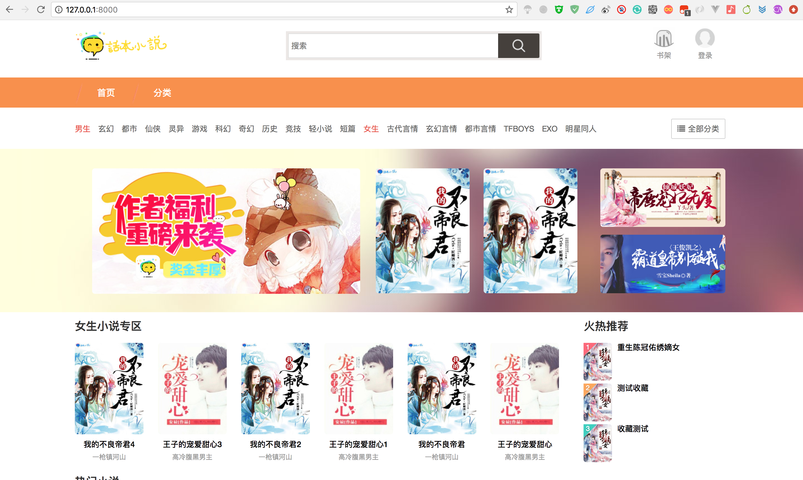
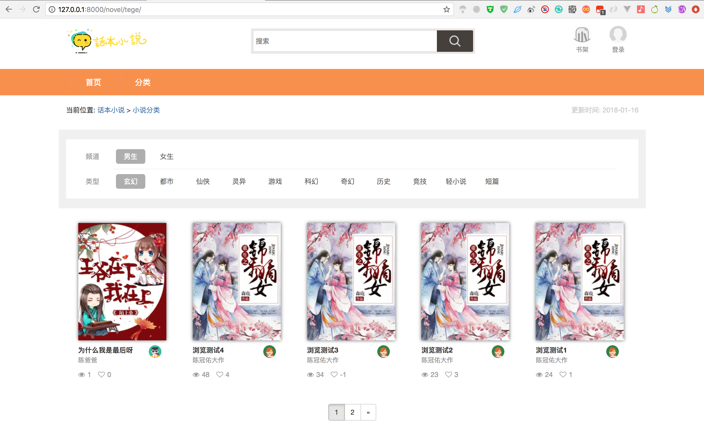
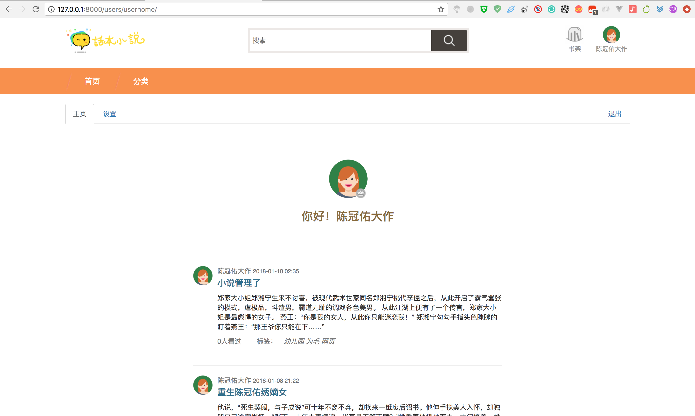
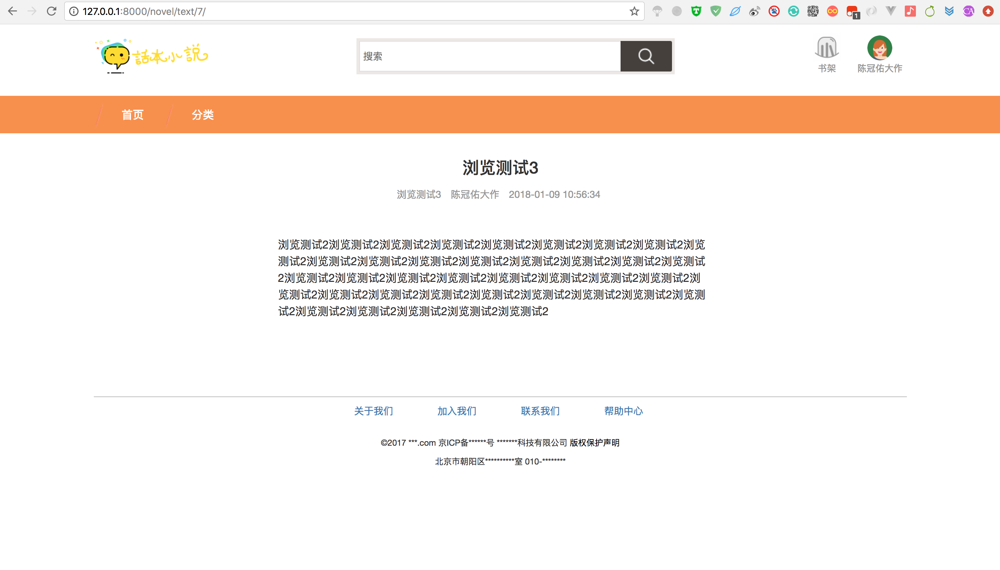
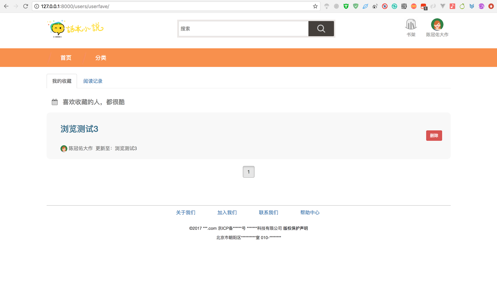
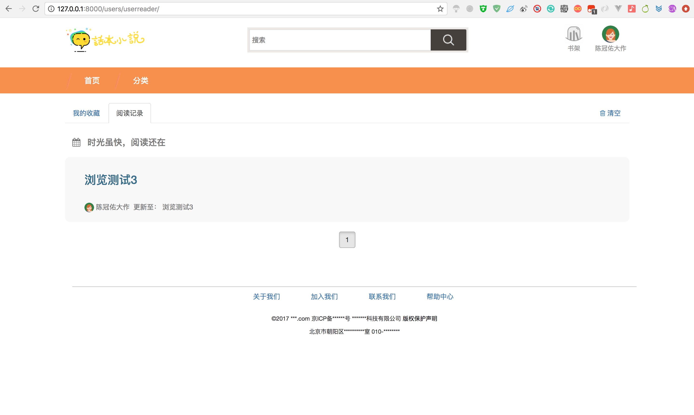
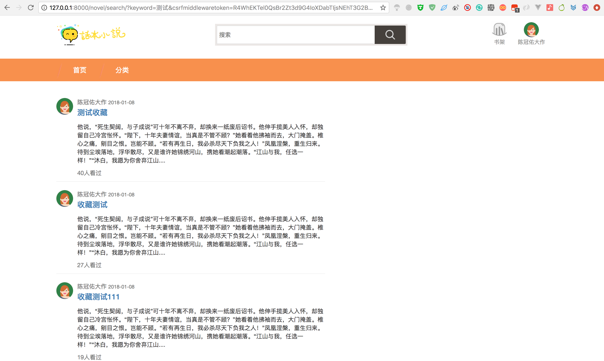
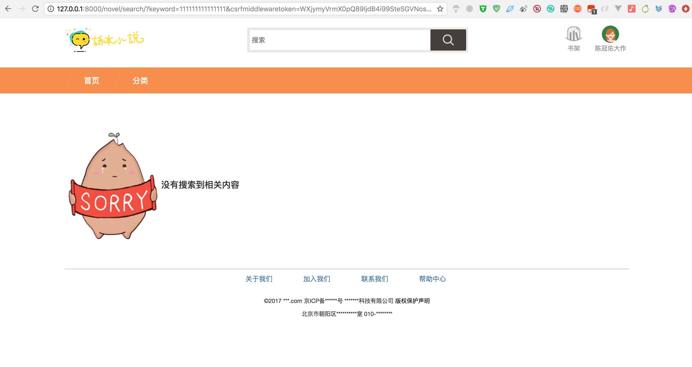

项目文档
=============
1.项目说明
-------------
>非常感谢大家可以欣赏Django-Imitation-osmetic-urge这个项目，中文名称小白读书，这个项目的本身非常的简单，没有什么技术难度！

2.所需要的环境与组件
-------------
>主要用到环境：Python3.6<br/>
>Django1.11.7<br/>
>Pymysql<br/>
>Mysql<br/>
>pure_pagination<br/>
>taggit<br/>
>captcha<br/>
>xadmin<br/>

3.安装
-------------
>1.下载项目后进入项目目录```cd Django-Imitation-osmetic-urge/Xiao_bai/```<br/>
>
>2.如果阁下没有安装上面我所说到的环境，请阁下自行安装。<br/>
>
>3.安装环境后请修改```Django-Imitation-osmetic-urge/Xiao_bai/```目录下的```settings.py```文件里面的```DATABASES ```数据库连接信息和邮箱配置信息<br/>
>
>4.然后进入项目根目录执行:```python manage.py makemigrations```<br/>
>
>5.在执行：```python manage.py migrate```
>
>6.在建创后台管理员```python manage.py createsuperuser```
><br/>


4.运行
-------------
>1.然后请阁下进入项目根目录执行```python manage.py runserver```<br/>
>
>2.然后访问```http://127.0.0.0:8000```<br/>
>
>3.后台地址```http://127.0.0.0:8000/admin/```<br/>
>

5.项目效果图
-------------
<br/>
<br/>
<br/>
<br/>
<br/>
<br/>
<br/>
<br/>
<br/>
<br/>
<br/>
<br/>
>项目不提供后期更新，有兴趣的小伙伴可以拿去玩玩
